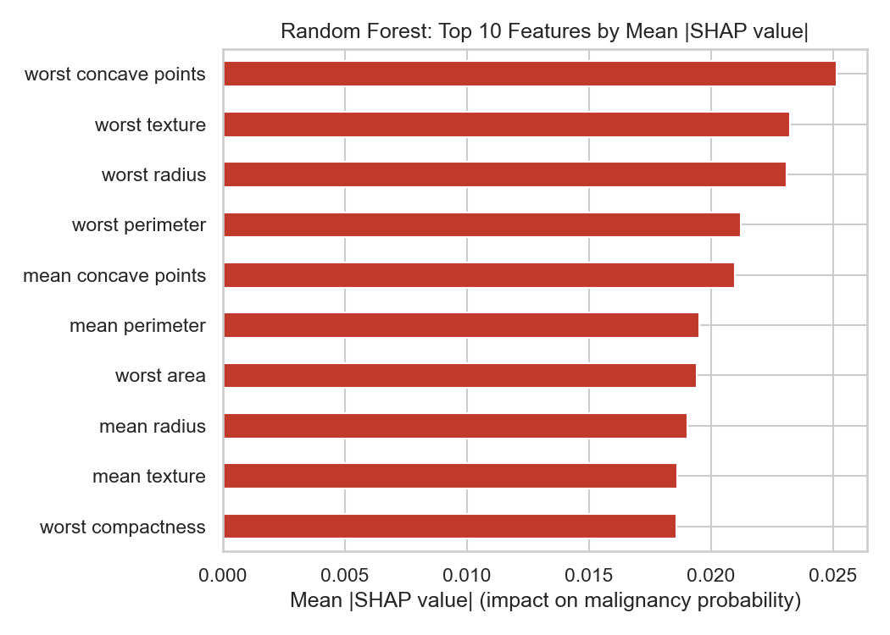
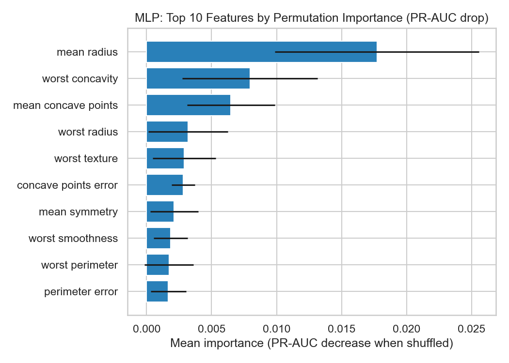
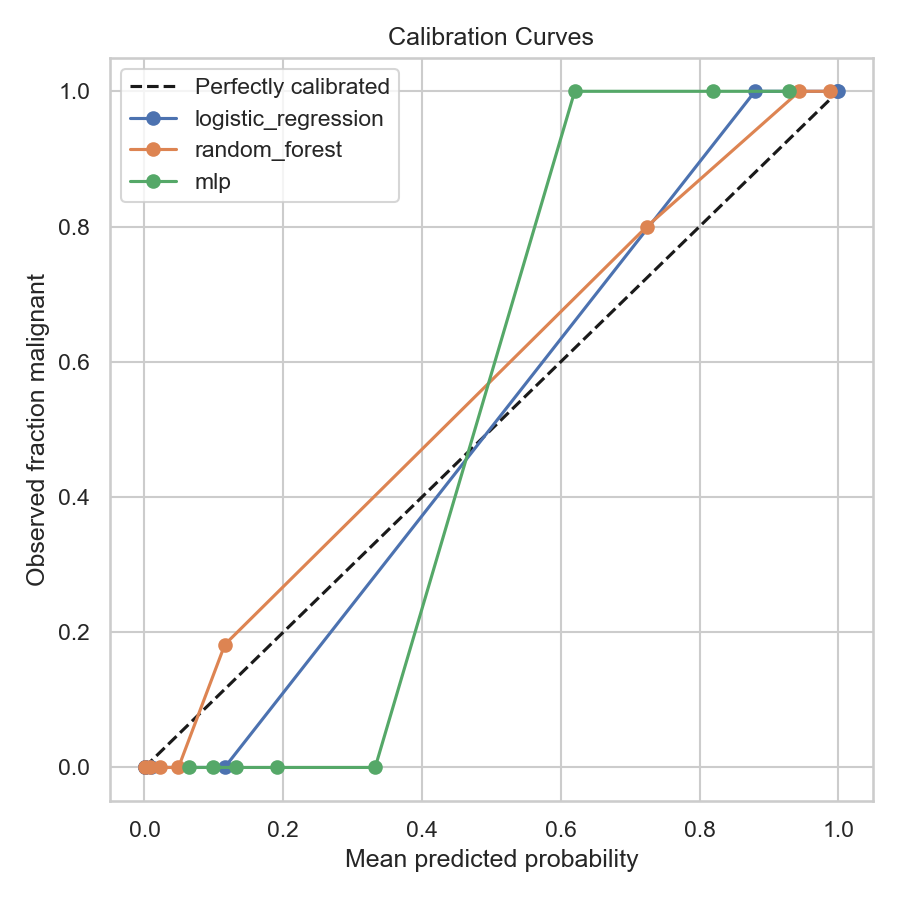

# Breast Cancer Diagnostic Audit

A leakage-free, clinically-labeled breast cancer classifier, built to
demonstrate (and guard against) a subtle but dangerous class of ML bug:
silently swapping which class counts as "positive" in a diagnostic metric.
Get that wrong and a model's central clinical claim — "this model has better
recall, i.e. it's better at catching cancer" — can end up describing
sensitivity to the *wrong* class entirely, while every test still passes and
every number still looks plausible.

## The bug this project guards against

`sklearn.datasets.load_breast_cancer()` encodes `target_names[0] == "malignant"`
(212 samples) and `target_names[1] == "benign"` (357 samples) — raw label `0`
means malignant. `sklearn`'s metric functions (`recall_score`, `precision_score`)
default to `pos_label=1`. It's an easy mistake to make: use the raw labels
directly while assuming `target == 1` means malignant — backwards from the
actual encoding — and nothing about the code will error out. Every metric
still computes, every plot still renders; it just silently measures the wrong
class.

`notebooks/exploration.ipynb` reproduces this in miniature (Part 1): the same
model, the same predictions, scored two ways —

| | "Recall" computed naively (`pos_label=1`, actually benign) | Actual malignant recall (sensitivity) |
|---|---|---|
| Score | 0.981 | 0.938 |

A 4.4-point gap between the naive number and the one that actually matters for
a cancer-screening task. In a domain where a false negative means a missed
cancer diagnosis, reporting the wrong class's recall isn't a rounding error.

## Why this matters clinically

In diagnostic screening, a **false negative** (predicting benign when the
tumor is malignant) is far costlier than a **false positive** (an unnecessary
follow-up test on a benign case). Accuracy and even "recall" in the abstract
don't capture that asymmetry — a model needs to be evaluated, and its decision
threshold chosen, with that cost imbalance in mind. See "Cost-sensitive
threshold tuning" below.

## Engineering choices

- **Label contract fixed at the source.** `bca/data.py` remaps labels once so
  `y == 1` always means malignant — the universal "positive = has the
  condition" clinical convention — instead of relying on remembering to pass
  `pos_label=0` correctly at every call site. `tests/test_data.py` pins this
  down with the exact assertions that would catch this exact class of bug.
- **Leakage-free model selection.** A naive approach might pick its "best"
  PCA component count by directly maximizing test-set accuracy — that's
  leakage. Here, `bca.validation.tune()` selects both PCA component count and
  model hyperparameters via 5-fold stratified cross-validation on the
  training set only — its function signature has no `X_test`/`y_test`
  parameters at all, so that kind of leakage is structurally impossible, not
  just avoided by discipline. The test set is touched exactly once, in
  `bca.metrics.evaluate()`.
- **Cost-sensitive threshold tuning.** Rather than the default 0.5 cutoff,
  `bca.metrics.tune_threshold()` picks the threshold that maximizes
  sensitivity subject to a minimum precision floor — chosen from
  cross-validated out-of-fold training predictions, never from the test set.
- **Explainability in clinical feature space, not PCA space.** A naive
  `shap.TreeExplainer` on the random forest would explain *PCA components*,
  not "mean radius" — technically valid but useless to a clinician. Instead,
  `bca.explain.shap_explanation` treats the whole fitted pipeline
  (scaler → PCA → model) as a black-box function of the original 30 features.
- **A calibration baseline.** Logistic regression is included specifically as
  a well-calibrated foil for comparing against RF/MLP's calibration curves.

## Results

Full pipeline: `StandardScaler → PCA → model`, tuned via 5-fold stratified CV
scored on average precision (PR-AUC), evaluated once on a held-out 15% test
set (`n=86`). Sensitivity = recall on malignant; specificity = recall on
benign.

| Model | Threshold | Accuracy | Sensitivity | Specificity | PPV | NPV | ROC-AUC | PR-AUC |
|---|---|---|---|---|---|---|---|---|
| Logistic Regression | 0.50 (default) | 0.988 | 0.969 | 1.000 | 1.000 | 0.982 | 1.000 | 1.000 |
| Logistic Regression | 0.213 (tuned) | 0.988 | 1.000 | 0.982 | 0.970 | 1.000 | 1.000 | 1.000 |
| Random Forest | 0.50 (default) | 0.965 | 0.938 | 0.982 | 0.968 | 0.964 | 0.997 | 0.995 |
| Random Forest | 0.393 (tuned) | 0.954 | 0.938 | 0.963 | 0.938 | 0.963 | 0.997 | 0.995 |
| MLP | 0.50 (default) | 0.988 | 0.969 | 1.000 | 1.000 | 0.982 | 1.000 | 1.000 |
| MLP | 0.440 (tuned) | 0.965 | 1.000 | 0.944 | 0.914 | 1.000 | 1.000 | 1.000 |

Full table (all metrics, both threshold modes): [`results.csv`](results.csv).
Best hyperparameters and PCA component counts are printed in
`notebooks/exploration.ipynb`, Part 3.

At the cost-sensitive threshold, both Logistic Regression and MLP reach
**100% sensitivity** on this test set (zero missed malignant cases) at a
modest specificity cost — exactly the tradeoff the tuned threshold is
designed to make, and the opposite of what a 0.5 cutoff optimizes for.

## Explainability





## Project structure

```
bca/
  data.py        # load + label-remap contract
  validation.py  # tune() / split_data() — structurally leakage-safe
  metrics.py     # clinical metrics + threshold tuning + evaluate()
  models.py      # RF/MLP/LogReg pipeline + param grid factories
  explain.py     # SHAP (RF) + permutation importance (MLP)
app.py           # Streamlit demo
notebooks/exploration.ipynb   # full narrative: bug repro -> fix -> results
tests/           # pytest — includes leakage guards and the label-swap check
docs/images/     # figures referenced above
models/          # trained pipelines + test set, generated by the notebook
```

## Setup

```bash
pip install -r requirements.txt
pytest -q                      # run the test suite
jupyter nbconvert --to notebook --execute --inplace notebooks/exploration.ipynb
streamlit run app.py           # interactive demo (needs models/ from the notebook run)
```

## Dataset

[Wisconsin Diagnostic Breast Cancer dataset](https://scikit-learn.org/stable/datasets/toy_dataset.html#breast-cancer-wisconsin-diagnostic-dataset),
loaded via `sklearn.datasets.load_breast_cancer` (no external download needed).
